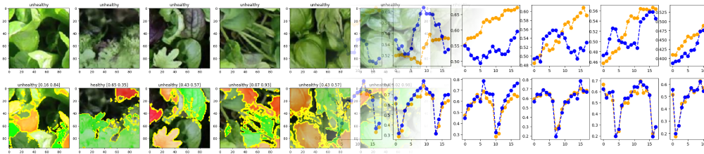

# Time Series Forecasting


Repository of the `Artificial Neural Networks and Deep Learning (AN2DL)` project with focus in **Time Series Forecasting**. The associated challenge was hosted on CodaLab platform.

## Team
<table align="center">
<tr><td>

| Name             |    ID    |
| :--------------- | :------: |
| Paolo Pertino    | 10729600 |
| Alberto Sandri   | 10698469 |
| Enrico Simionato | 10698193 |

</td><td>

|    Professor & Tutors      |                   Role                 |
|:---------------------------|:--------------------------------------:|
| Matteo Matteucci               | AN2DL Professor |
| Giacomo Boracchi         | AN2DL Professor |
| Eugenio Lomurno | Teaching Assistant |
| Loris Giulivi | Teaching Assistant |
| Francesco Lattari | Teaching Assistant |


</td></tr> </table>


## Project structure
The project is divided in two homeworks, this repository contains the second part. The project code is contained in a single Jupyter Notebook.

### Description of the project:

This homework addresses the challenge of time series forecasting using various deep neural networks. The objective is to forecast the future 9 and 18 samples of time series, that in the test set have length 200. The metric used to evaluate models is the Mean Squared Error. Here an outline of methods, techniques, and results:

- #### Data Exploration and Preprocessing

  - Identified and eliminated duplicated time series.
  - Explored preprocessing with Scikit-Learn *RobustScaler* and *auto-arima* function leveraging the Box-Jenkins method to identify the time series order and determined an optimal window size of 100-150 samples.
 
- #### Best Model - Ensemble

  - Ensemble of N-Beats and Bidirectional LSTM models achieved superior performance with MSE of 0.0049 in the first phase and MSE of 0.0102 in the second phase.
  - Diversified models through varying input window duration,  bootstrapping, and number of stacks for N-Beats.

- #### Model Experiments

  - ##### LSTM + Conv

    - Blend of bidirectional LSTM layers and one-dimensional convolutional layers.
    - Initial promising results, but hyperparameter tuning revealed reduced capacity and tendency to overfit.

  - ##### Bidirectional LSTM

    - Singular layer of bidirectional LSTMs enabling concurrent forward and backward sequence processing for improved comprehension of temporal patterns.
    - Dropout enhanced generalization, outperforming more complex alternatives with MSE around 0.0055.

  - ##### Category-Integrated Neural Network (CINN)

    - Explored embedding category information within the network using one-hot encoding.
    - Achieved MSE of 0.0058, but limitations observed, questioning the utility of categories.

  - ##### Model on Detrended and Deseasoned Time Series

    - Attempted enhanced LSTM outcomes through systematic detrending and deseasoning.
    - Results were not as promising, potential limitations in custom implementation and universal application across all series.

  - ##### N-BEATS

    - Utilized N-Beats architecture based on backward and forward residual links and a deep stack of fully-connected layers.
    - Performance measured with MSE around 0.0065 on 1st phase.

  - ##### Time2Vec

    - Incorporated Time2Vec technique to encode temporal information into vectors.
    - Minimal improvements observed despite modifications.


## Requirements & Installation
To install this project dependencies please run the following command:
```bash
pip install -r requirements.txt
```

## Folder structure
<pre>
├── Assets
│   └── bannerAN2DL.png
├── ANNDL-Homework2-Report.pdf
├── Homework_2.ipynb
├── README.md
└── requirements.txt
</pre>

## References
[1] Oreshkin, B. N., Carpov, D., Chapados, N., & Bengio, Y. (2020). N-BEATS: Neural basis expansion analysis for interpretable time series forecasting. International Conference on Learning Representations. https://www.openreview.net/pdf?id=r1ecqn4YwB

[2] Remy, P. (2020). N-BEATS: Neural basis expansion analysis for interpretable time series forecasting. In GitHub repository. GitHub. https://github.com/philipperemy/n-beats

[3] Cote, D. (2022) Hands-On Advanced Deep Learning Time Series Forecasting with Tensors, Medium. Available at: https://medium.com/@dave.cote.msc/hands-on-advanced-deep-learning-time-series-forecasting-with-tensors-7facae522f18


